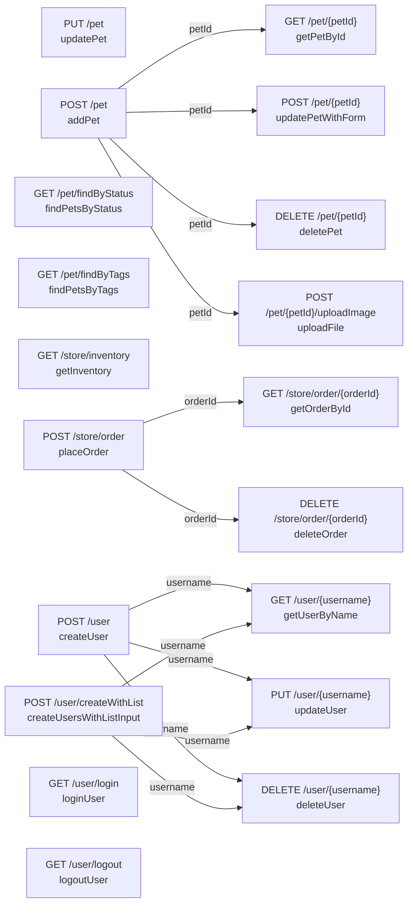

# petstore operation graph

Generated by `node tools/discover.ts petstore`. Edges are heuristic — confirm or edit.

```mermaid
flowchart LR
  updatePet["PUT /pet<br/>updatePet"]
  addPet["POST /pet<br/>addPet"]
  findPetsByStatus["GET /pet/findByStatus<br/>findPetsByStatus"]
  findPetsByTags["GET /pet/findByTags<br/>findPetsByTags"]
  getPetById["GET /pet/{petId}<br/>getPetById"]
  updatePetWithForm["POST /pet/{petId}<br/>updatePetWithForm"]
  deletePet["DELETE /pet/{petId}<br/>deletePet"]
  uploadFile["POST /pet/{petId}/uploadImage<br/>uploadFile"]
  getInventory["GET /store/inventory<br/>getInventory"]
  placeOrder["POST /store/order<br/>placeOrder"]
  getOrderById["GET /store/order/{orderId}<br/>getOrderById"]
  deleteOrder["DELETE /store/order/{orderId}<br/>deleteOrder"]
  createUser["POST /user<br/>createUser"]
  createUsersWithListInput["POST /user/createWithList<br/>createUsersWithListInput"]
  loginUser["GET /user/login<br/>loginUser"]
  logoutUser["GET /user/logout<br/>logoutUser"]
  getUserByName["GET /user/{username}<br/>getUserByName"]
  updateUser["PUT /user/{username}<br/>updateUser"]
  deleteUser["DELETE /user/{username}<br/>deleteUser"]
  addPet -->|petId| getPetById
  addPet -->|petId| updatePetWithForm
  addPet -->|petId| deletePet
  addPet -->|petId| uploadFile
  placeOrder -->|orderId| getOrderById
  placeOrder -->|orderId| deleteOrder
  createUser -->|username| getUserByName
  createUsersWithListInput -->|username| getUserByName
  createUser -->|username| updateUser
  createUsersWithListInput -->|username| updateUser
  createUser -->|username| deleteUser
  createUsersWithListInput -->|username| deleteUser
```
