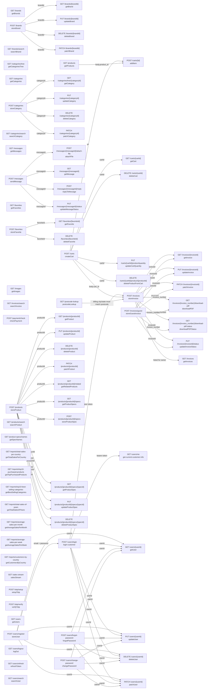

# toolshop operation graph

Generated by `node tools/discover.ts toolshop`. Edges are heuristic — confirm or edit.

```mermaid
flowchart LR
  getBrands["GET /brands<br/>getBrands"]
  storeBrand["POST /brands<br/>storeBrand"]
  getBrand["GET /brands/{brandId}<br/>getBrand"]
  updateBrand["PUT /brands/{brandId}<br/>updateBrand"]
  deleteBrand["DELETE /brands/{brandId}<br/>deleteBrand"]
  patchBrand["PATCH /brands/{brandId}<br/>patchBrand"]
  searchBrand["GET /brands/search<br/>searchBrand"]
  createCart["POST /carts<br/>createCart"]
  addItem["POST /carts/{id}<br/>addItem"]
  getCart["GET /carts/{cartId}<br/>getCart"]
  deleteCart["DELETE /carts/{cartId}<br/>deleteCart"]
  updateCartQuantity["PUT /carts/{cartId}/product/quantity<br/>updateCartQuantity"]
  deleteProductFromCart["DELETE /carts/{cartId}/product/{productId}<br/>deleteProductFromCart"]
  getCategoriesTree["GET /categories/tree<br/>getCategoriesTree"]
  getCategories["GET /categories<br/>getCategories"]
  storeCategory["POST /categories<br/>storeCategory"]
  getCategory["GET /categories/tree/{categoryId}<br/>getCategory"]
  searchCategory["GET /categories/search<br/>searchCategory"]
  updateCategory["PUT /categories/{categoryId}<br/>updateCategory"]
  deleteCategory["DELETE /categories/{categoryId}<br/>deleteCategory"]
  patchCategory["PATCH /categories/{categoryId}<br/>patchCategory"]
  getMessages["GET /messages<br/>getMessages"]
  sendMessage["POST /messages<br/>sendMessage"]
  attachFile["POST /messages/{messageId}/attach-file<br/>attachFile"]
  getMessage["GET /messages/{messageId}<br/>getMessage"]
  replyToMessage["POST /messages/{messageId}/reply<br/>replyToMessage"]
  updateMessageStatus["PUT /messages/{messageId}/status<br/>updateMessageStatus"]
  getFavorites["GET /favorites<br/>getFavorites"]
  storeFavorite["POST /favorites<br/>storeFavorite"]
  getFavorite["GET /favorites/{favoriteId}<br/>getFavorite"]
  deleteFavorite["DELETE /favorites/{favoriteId}<br/>deleteFavorite"]
  getImages["GET /images<br/>getImages"]
  getInvoices["GET /invoices<br/>getInvoices"]
  storeInvoice["POST /invoices<br/>storeInvoice"]
  storeGuestInvoice["POST /invoices/guest<br/>storeGuestInvoice"]
  getInvoice["GET /invoices/{invoiceId}<br/>getInvoice"]
  updateInvoice["PUT /invoices/{invoiceId}<br/>updateInvoice"]
  patchInvoice["PATCH /invoices/{invoiceId}<br/>patchInvoice"]
  downloadPDF["GET /invoices/{invoice_number}/download-pdf<br/>downloadPDF"]
  downloadPDFStatus["GET /invoices/{invoice_number}/download-pdf-status<br/>downloadPDFStatus"]
  updateInvoiceStatus["PUT /invoices/{invoiceId}/status<br/>updateInvoiceStatus"]
  searchInvoice["GET /invoices/search<br/>searchInvoice"]
  checkPayment["POST /payment/check<br/>checkPayment"]
  postcodeLookup["GET /postcode-lookup<br/>postcodeLookup"]
  getProducts["GET /products<br/>getProducts"]
  storeProduct["POST /products<br/>storeProduct"]
  getProduct["GET /products/{productId}<br/>getProduct"]
  updateProduct["PUT /products/{productId}<br/>updateProduct"]
  deleteProduct["DELETE /products/{productId}<br/>deleteProduct"]
  patchProduct["PATCH /products/{productId}<br/>patchProduct"]
  getRelatedProducts["GET /products/{productId}/related<br/>getRelatedProducts"]
  searchProduct["GET /products/search<br/>searchProduct"]
  getProductSpecs["GET /products/{productId}/specs<br/>getProductSpecs"]
  storeProductSpec["POST /products/{productId}/specs<br/>storeProductSpec"]
  getProductSpec["GET /products/{productId}/specs/{specId}<br/>getProductSpec"]
  updateProductSpec["PUT /products/{productId}/specs/{specId}<br/>updateProductSpec"]
  deleteProductSpec["DELETE /products/{productId}/specs/{specId}<br/>deleteProductSpec"]
  getSpecNames["GET /product-specs/names<br/>getSpecNames"]
  getTotalSalesPerCountry["GET /reports/total-sales-per-country<br/>getTotalSalesPerCountry"]
  getTopPurchasedProducts["GET /reports/top10-purchased-products<br/>getTopPurchasedProducts"]
  getBestSellingCategories["GET /reports/top10-best-selling-categories<br/>getBestSellingCategories"]
  getTotalSalesOfYears["GET /reports/total-sales-of-years<br/>getTotalSalesOfYears"]
  getAverageSalesPerMonth["GET /reports/average-sales-per-month<br/>getAverageSalesPerMonth"]
  getAverageSalesPerWeek["GET /reports/average-sales-per-week<br/>getAverageSalesPerWeek"]
  getCustomersByCountry["GET /reports/customers-by-country<br/>getCustomersByCountry"]
  salesStream["GET /sales-stream<br/>salesStream"]
  setupTotp["POST /totp/setup<br/>setupTotp"]
  verifyTotp["POST /totp/verify<br/>verifyTotp"]
  getUsers["GET /users<br/>getUsers"]
  storeUser["POST /users/register<br/>storeUser"]
  login_customer["POST /users/login<br/>login-customer"]
  forgotPassword["POST /users/forgot-password<br/>forgotPassword"]
  changePassword["POST /users/change-password<br/>changePassword"]
  get_current_customer_info["GET /users/me<br/>get-current-customer-info"]
  logOut["GET /users/logout<br/>logOut"]
  refreshToken["GET /users/refresh<br/>refreshToken"]
  getUser["GET /users/{userId}<br/>getUser"]
  updateUser["PUT /users/{userId}<br/>updateUser"]
  deleteUser["DELETE /users/{userId}<br/>deleteUser"]
  patchUser["PATCH /users/{userId}<br/>patchUser"]
  searchUser["GET /users/search<br/>searchUser"]
  storeBrand -->|brandId| getBrand
  storeBrand -->|brandId| updateBrand
  storeBrand -->|brandId| deleteBrand
  storeBrand -->|brandId| patchBrand
  createCart -->|id| addItem
  createCart -->|cartId| getCart
  createCart -->|cartId| deleteCart
  createCart -->|cartId| updateCartQuantity
  createCart -->|cartId| deleteProductFromCart
  storeCategory -->|categoryId| getCategory
  storeCategory -->|categoryId| updateCategory
  storeCategory -->|categoryId| deleteCategory
  storeCategory -->|categoryId| patchCategory
  sendMessage -->|messageId| attachFile
  sendMessage -->|messageId| getMessage
  sendMessage -->|messageId| replyToMessage
  sendMessage -->|messageId| updateMessageStatus
  storeFavorite -->|favoriteId| getFavorite
  storeFavorite -->|favoriteId| deleteFavorite
  storeInvoice -->|invoiceId| getInvoice
  storeGuestInvoice -->|invoiceId| getInvoice
  storeInvoice -->|invoiceId| updateInvoice
  storeGuestInvoice -->|invoiceId| updateInvoice
  storeInvoice -->|invoiceId| patchInvoice
  storeGuestInvoice -->|invoiceId| patchInvoice
  storeInvoice -->|invoice_number| downloadPDF
  storeGuestInvoice -->|invoice_number| downloadPDF
  storeInvoice -->|invoice_number| downloadPDFStatus
  storeGuestInvoice -->|invoice_number| downloadPDFStatus
  storeInvoice -->|invoiceId| updateInvoiceStatus
  storeGuestInvoice -->|invoiceId| updateInvoiceStatus
  storeProduct -->|productId| getProduct
  storeProduct -->|productId| updateProduct
  storeProduct -->|productId| deleteProduct
  storeProduct -->|productId| patchProduct
  storeProduct -->|productId| getRelatedProducts
  storeProduct -->|productId| getProductSpecs
  storeProduct -->|productId| storeProductSpec
  storeProduct -->|productId| getProductSpec
  storeProduct -->|specId| getProductSpec
  storeProduct -->|productId| updateProductSpec
  storeProduct -->|specId| updateProductSpec
  storeProduct -->|productId| deleteProductSpec
  storeProduct -->|specId| deleteProductSpec
  storeUser -->|userId| getUser
  login_customer -->|userId| getUser
  forgotPassword -->|userId| getUser
  changePassword -->|userId| getUser
  storeUser -->|userId| updateUser
  login_customer -->|userId| updateUser
  forgotPassword -->|userId| updateUser
  changePassword -->|userId| updateUser
  storeUser -->|userId| deleteUser
  login_customer -->|userId| deleteUser
  forgotPassword -->|userId| deleteUser
  changePassword -->|userId| deleteUser
  storeUser -->|userId| patchUser
  login_customer -->|userId| patchUser
  forgotPassword -->|userId| patchUser
  changePassword -->|userId| patchUser
  login_customer -->|bearer token| storeInvoice
  login_customer -->|bearer token| get_current_customer_info
  storeUser -->|email + password| login_customer
  getProducts -->|body.product_id| addItem
  createCart -->|body.cart_id| storeInvoice
  postcodeLookup -->|billing city/state must match postcode| storeInvoice
  storeInvoice -->|listed for owner| getInvoices
```
